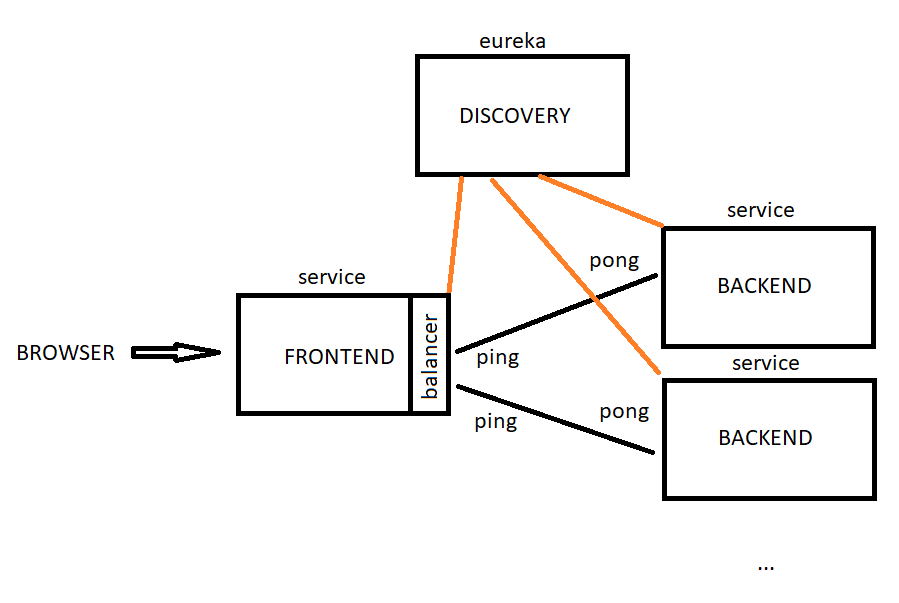

# spring-service-discovery-example
Spring service discovery example for education purposes (with Docker)

Architecture picture   

**Projects**  
_discovery (8080 port)_ - spring eureka server  
_frontend (8081 port)_ - spring frontend(ping) service  
_backend (8082 port)_ - spring backend(pong) service

**Local run**  
gradle run _bootRun_ task for each project  

**Docker**  
1. gradle run _jibDockerBuild_ task for each project  
2. _docker-compose up_  

GET http://localhost:8081/backend/ping  
returns pong + service instance-id

scale _backend_ container whatever you want